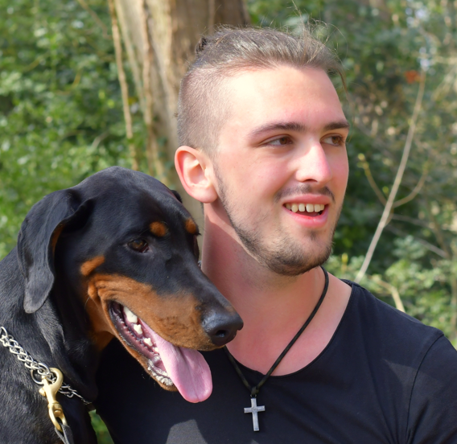

<h1 align="center">Jeff De Meutter</h1>
<table>
    <tr>
        <td rowspan="2" colspan="2">
            <h2 align="center">Projects</h2>
            <b>> <a href="https://github.com/Tboske/TribeEngine/tree/rework">TribeEngine</a></b> 
            This is a custom engine designed by me using SDL2 and opengl. I have remade Tron arcade in Tribe.   
            <b>> <a href="https://discool.itch.io/discool">Discool</a></b> 
            This was my first group project. I was one of the two programmers that worked on this Unity project. In Discool I mainly worked on the parallax effect, generation of the buildings, the combo system and some smaller feautures.  
            <b>> <a href="https://github.com/Tboske/HierarchicalStateMachine">Hierarchical State Machine</a></b> 
            One of my school assignments, where I researched Hierarchical State Machines and implemented it.  
            <b>> <a href="https://github.com/Tboske/ComSync">ComSync</a></b> 
            Here I played around with some networking using boost::asio. By utilizing UDP and TCP to send packages to other local pc's.  
            <b>> <a href="https://github.com/Tboske/Tribe2.0">Tribe2.0</a> WIP</b> 
            This is the successor to TribeEngine, which I work on in my free time. It's a complete redesign with a different set of libraries. 
            Here I use GLFW instead of SDL2. I have implemented Vulkan before, but now I am aiming to include that in this engine as well.
        </td>
        <td>
            <h2 align="center">About Me</h2>
            I'm 22 year old and a Game Development student at Howest - DAE. 
            In my free time I mainly train (<a href="https://en.wikipedia.org/wiki/Schutzhund#:~:text=Schutzhund%20(%2F'%CA%83%CA%8Atsh%CA%8Ant%2F%2C%20German%20for,of%20a%20good%20working%20dog." target="_blank">IGP</a>) with my dog. Other than that, I do some detailing and maintenance on my car.
        </td>
    </tr>
    <tr>
        <td>
            
        </td>
    </tr>
    <tr>
        <td>
            <h2 align="center">Hard Skills</h2>
            <b>> c/c++</b> 
            <b>> c#</b> 
            <b>> Unity</b> 
            <b>> Cmake</b> 
            <b>> Python</b>
        </td>
        <td>
            <h2 align="center">Soft Skills</h2>
            <b>> Cooperation</b>             
            <b>> Communicative</b>             
            <b>> Adaptibility</b>             
            <b>> Resilience</b> 
            <b>> tidiness</b> 
        </td>
        <td>
            <h2 align="center">Studies</h2>
            <b>Ongoing: Digital Arts & Entertainement</b> 
            &emsp;&emsp;Howest - Kortrijk, Belgium  
            <b>Finished: IT Management</b> 
            &emsp;&emsp;MiniemenInstituut - Leuven, Belgium 
        </td>
    </tr>
    <tr>
        <td colspan="3">
            <h2 align="center">Contact</h2>
            <b>Mail: jeffke.de.meutter@gmail.com</b>&emsp;&emsp;&emsp;&emsp;&emsp;&emsp;&emsp;&emsp;&emsp;
            <b>Phone: +32 498/14.05.20</b>&emsp;&emsp;&emsp;&emsp;&emsp;&emsp;&emsp;&emsp;&emsp;&emsp;&emsp;&emsp;&emsp;
            <b><a href="https://www.linkedin.com/feed/?trk=homepage-basic_google-one-tap-submit">LinkedIn</a></b>
        </td>
    </tr>
</table>
